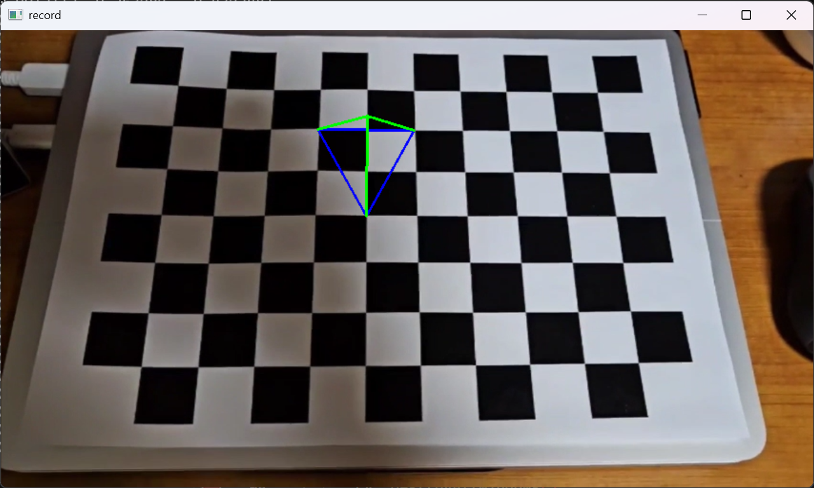

# cv_pose_estimation
simple pose estimation example and drawing tetrahedron on chessboard

# camera pose
X: 0.0959248

Y: 0.292754

Z: -0.411275

Roll: -0.479485 (in Radian)

Pitch: -0.047491 (in Radian)

Yaw: 0.0037414 (in Radian)

# AR Object Visualization
